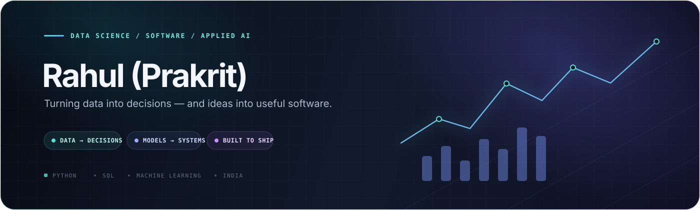

 

### I turn data into decisions — and ideas into useful software.

**Data Science Analyst** &nbsp;·&nbsp; **Software Engineer** &nbsp;·&nbsp; **Applied AI Enthusiast**

 

 

`DATA → DECISIONS → SYSTEMS` &nbsp; ✦ &nbsp; Building with curiosity from **India**

---

## &nbsp;01 / A little about me

I’m **Rahul (Prakrit) Dodke** — a data science analyst who enjoys working across the whole problem-solving loop: understanding the question, making the data trustworthy, finding the signal, and delivering something people can actually use.

My toolkit spans **Python, SQL, analytics, machine learning, and software engineering**. I’m especially interested in practical ML, forecasting, computer vision, and the fast-moving world of LLMs and RAG.

 

| &nbsp; | &nbsp; | &nbsp; | &nbsp; |
|:---:|:---:|:---:|:---:|
| <strong>100K+</strong> records analyzed weekly | <strong>99.9%</strong> preprocessing accuracy | <strong>+15%</strong> decision-making improvement | <strong>3+ years</strong> data & software experience |

 

## &nbsp;02 / Selected builds

| &nbsp;01 · FORECASTING &nbsp; | &nbsp;02 · FULL-STACK + AI &nbsp; |
|:---|:---|
| **📈 [Sales Forecasting](https://github.com/RDrahul123/Sales-Forecasting)** An end-to-end system for predicting daily sales at the store level, with multiple model families and an interactive web app.  `PYTHON` &nbsp; `MACHINE LEARNING` &nbsp; `TIME SERIES` | **✅ [MarkIt](https://github.com/RDrahul123/MarkIt---AI-Powered-Attendance-Manager)** A full-stack attendance manager bringing together Excel workflows, real-time tracking, and AI-assisted analytics.  `REACT` &nbsp; `FASTAPI` &nbsp; `POSTGRESQL` |
| &nbsp;03 · LEARNING IN PUBLIC &nbsp; | &nbsp;04 · CREATIVE TOOLING &nbsp; |
| **🧠 [LLMs](https://github.com/RDrahul123/LLMs)** A practical, open course exploring prompt engineering, APIs, RAG, and fine-tuning.  `PYTHON` &nbsp; `LLMS` &nbsp; `RAG` | **🗒️ [Notiva Notes](https://github.com/RDrahul123/Notiva-Notes)** An offline-first, graph-based notes app inspired by Obsidian. Your notes stay in your browser.  `HTML` &nbsp; `JAVASCRIPT` &nbsp; `OFFLINE-FIRST` |

**[Explore the full portfolio ↗](https://rdrahul123.github.io/Portfolio-v3/)**

 

## &nbsp;03 / The toolkit

| **Analyze** | **Build** | **Ship** |
|:---|:---|:---|
| Python · SQL · Pandas · NumPy · Power BI | Scikit-learn · TensorFlow · FastAPI · React | Git · Docker · AWS · PostgreSQL |

 

## &nbsp;04 / Currently curious about

`LLMs & RAG` &nbsp; ◇ &nbsp; `Forecasting` &nbsp; ◇ &nbsp; `Applied ML` &nbsp; ◇ &nbsp; `Reliable data pipelines`

 

## &nbsp;05 / GitHub, in motion

&nbsp;&nbsp;

 

&nbsp;&nbsp;

 

 

## &nbsp;06 / Contribution calendar

<picture>
  <source media="(prefers-color-scheme: dark)" srcset="https://raw.githubusercontent.com/RDrahul123/RDrahul123/output/github-contribution-grid-snake-dark.svg" />
  <source media="(prefers-color-scheme: light)" srcset="https://raw.githubusercontent.com/RDrahul123/RDrahul123/output/github-contribution-grid-snake.svg" />
  
</picture>

A little snake, a lot of commits. The contribution animation refreshes daily.

 

## &nbsp;07 / Projects in focus

&nbsp;

 

### Have a good problem to solve?

I’m always up for thoughtful conversations, interesting collaborations, and opportunities to build meaningful things.

[**Say hello on LinkedIn ↗**](https://www.linkedin.com/in/rahul-dodke/) &nbsp; · &nbsp; [**Browse my work ↗**](https://rdrahul123.github.io/Portfolio-v3/)

 

*“I glide, I pivot, I thrive, I shine, and my peace is fully paid.”* 🤓

Made with curiosity, clean data, and a little bit of ☕

